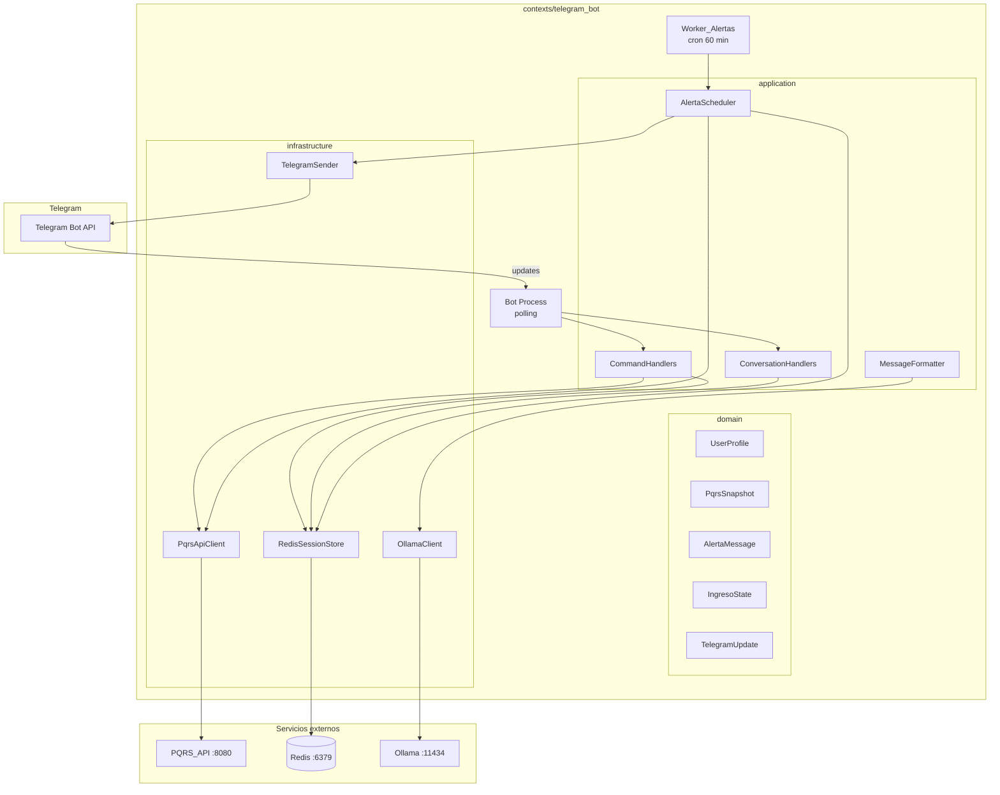

# Diseño Técnico — Bot de Telegram PQRS Medellín

## Overview

El bot de Telegram es un nuevo bounded context (`contexts/telegram_bot/`) que expone el sistema PQRS de la Alcaldía de Medellín como canal conversacional. Actúa como cliente de la PQRS_API (`http://127.0.0.1:8080/api/v1`) y de Ollama, sin acceso directo a Postgres.

**Modo de operación**: polling largo (`python-telegram-bot` v21+ async) para desarrollo local, sin necesidad de URL pública. El bot corre como proceso Python independiente; el Worker_Alertas corre como proceso separado en el mismo contexto.

**Decisiones de diseño clave**:
- Python 3.11+ con `python-telegram-bot` v21 (async/await nativo, ConversationHandler integrado).
- Redis como única fuente de verdad para sesiones, roles y deduplicación de alertas.
- Sin acceso directo a Postgres: toda la lógica de negocio pasa por la PQRS_API.
- Arquitectura DDD: dominio, aplicación e infraestructura separados dentro del contexto.
- Logging estructurado JSON con Chat_Id anonimizado (SHA-256).

---

## Architecture



**Procesos**:
1. `bot.py` — proceso principal, polling Telegram, maneja comandos y conversaciones.
2. `worker_alertas.py` — proceso separado, loop `asyncio` con `asyncio.sleep(3600)`, consulta PQRS_API y despacha alertas.

---

## Components and Interfaces

### domain/

#### `UserProfile`
Representa el estado persistido de un usuario registrado.

```python
@dataclass
class UserProfile:
    chat_id: int
    rol: Literal["ciudadano", "funcionario"]
    alertas_activas: bool
    registered_at: datetime
    intentos_fallidos: int = 0
    bloqueado_hasta: datetime | None = None
```

#### `PqrsSnapshot`
Vista reducida de una PQRS para respuestas del bot.

```python
@dataclass
class PqrsSnapshot:
    id: str
    tipo: str | None
    estado_clasificacion: str
    estado_gestion: str | None
    nivel_riesgo: str | None
    secretaria_nombre: str | None
    fecha_limite: date | None
    summary_executive: str | None
```

#### `IngresoState`
Estado del flujo conversacional de ingreso de nueva PQRS.

```python
@dataclass
class IngresoState:
    chat_id: int
    tipo: str | None = None          # P/Q/R/S/D
    descripcion: str | None = None
    nombre_solicitante: str | None = None
    step: Literal["tipo", "descripcion", "nombre", "confirmacion"] = "tipo"
    created_at: datetime = field(default_factory=datetime.utcnow)
```

#### `TelegramUpdate`
Estructura interna que mapea el JSON de la Telegram Bot API.

```python
@dataclass
class TelegramUpdate:
    update_id: int
    message: TelegramMessage | None = None
    callback_query: TelegramCallbackQuery | None = None

@dataclass
class TelegramMessage:
    message_id: int
    chat_id: int
    text: str | None
    date: int

@dataclass
class TelegramCallbackQuery:
    id: str
    chat_id: int
    data: str | None
    message_id: int
```

#### `AlertaMessage`
Mensaje de alerta a despachar a un funcionario.

```python
@dataclass
class AlertaMessage:
    chat_id: int
    pqrs_id: str
    tipo: str | None
    nivel_riesgo: str | None
    secretaria_nombre: str | None
    fecha_limite: date | None
    horas_restantes: float
    es_urgente: bool  # CRITICO y < 4 horas
```

---

### application/

#### `CommandHandlers`
Handlers async para cada comando Telegram. Cada handler recibe `Update` y `ContextTypes.DEFAULT_TYPE` de `python-telegram-bot`.

| Handler | Comando | Rol requerido |
|---------|---------|---------------|
| `start_handler` | `/start` | cualquiera |
| `pqrs_handler` | `/pqrs {id}` | cualquiera |
| `pendientes_handler` | `/pendientes` | funcionario |
| `metricas_handler` | `/metricas` | funcionario |
| `secretaria_handler` | `/secretaria {codigo}` | funcionario |
| `secretarias_handler` | `/secretarias` | funcionario |
| `alertas_handler` | `/alertas on\|off` | funcionario |
| `nueva_consulta_handler` | `/nueva_consulta` | cualquiera |
| `cancelar_handler` | `/cancelar` | cualquiera |
| `fallback_handler` | texto libre | cualquiera → IA |

#### `ConversationHandlers`
Maneja el flujo multi-paso de `/nueva_pqrs` usando `ConversationHandler` de `python-telegram-bot`.

Estados del ConversationHandler:
```
SELECCIONAR_TIPO → INGRESAR_DESCRIPCION → INGRESAR_NOMBRE → CONFIRMAR → END
```

#### `AlertaScheduler`
Loop async que corre en `worker_alertas.py`:

```python
async def run_forever(interval_seconds: int = 3600):
    while True:
        await dispatch_alertas()
        await asyncio.sleep(interval_seconds)
```

#### `MessageFormatter`
Funciones puras que convierten estructuras de dominio en strings Markdown para Telegram.

```python
def format_pqrs_detail(snap: PqrsSnapshot) -> str: ...
def format_pqrs_list_item(item: PqrsSnapshot, idx: int) -> str: ...
def format_metricas(data: dict) -> str: ...
def format_alerta(alerta: AlertaMessage) -> str: ...
def format_secretaria_list(secretarias: list[dict]) -> str: ...
```

---

### infrastructure/

#### `PqrsApiClient`
Cliente HTTP async sobre `httpx.AsyncClient`.

```python
class PqrsApiClient:
    base_url: str  # http://127.0.0.1:8080/api/v1

    async def get_pqrs(self, pqrs_id: str) -> PqrsSnapshot | None: ...
    async def get_pendientes_prioridad(self, page: int = 1, per_page: int = 10) -> list[PqrsSnapshot]: ...
    async def get_metricas(self) -> dict: ...
    async def get_secretarias(self) -> list[dict]: ...
    async def get_pqrs_por_secretaria(self, codigo: str, per_page: int = 10) -> list[PqrsSnapshot] | None: ...
    async def crear_pqrs(self, payload: dict) -> dict: ...
    async def assist_mensaje_gestion(self, mensaje: str, contexto: list[dict], rol: str) -> str: ...
```

Manejo de errores HTTP:
- 404 → retorna `None` (el handler decide el mensaje).
- 5xx / timeout → lanza `PqrsApiError` con código y mensaje.

#### `RedisSessionStore`
Abstracción sobre `redis.asyncio`.

```python
class RedisSessionStore:
    # Claves Redis
    # bot:user:{chat_id}          → hash con campos de UserProfile
    # bot:session:{chat_id}       → list JSON (últimos 10 mensajes)
    # bot:ingreso:{chat_id}       → hash con campos de IngresoState (TTL 15 min)
    # bot:alerta_enviada:{id}:{fecha} → string "1" (TTL 24h)
    # bot:registro_bloqueado:{chat_id} → string timestamp (TTL 10 min)

    async def get_user(self, chat_id: int) -> UserProfile | None: ...
    async def save_user(self, profile: UserProfile) -> None: ...
    async def get_all_funcionarios(self) -> list[UserProfile]: ...
    async def get_session(self, chat_id: int) -> list[dict]: ...
    async def append_session(self, chat_id: int, message: dict) -> None: ...
    async def clear_session(self, chat_id: int) -> None: ...
    async def get_ingreso(self, chat_id: int) -> IngresoState | None: ...
    async def save_ingreso(self, state: IngresoState) -> None: ...
    async def clear_ingreso(self, chat_id: int) -> None: ...
    async def alerta_ya_enviada(self, pqrs_id: str, fecha: str) -> bool: ...
    async def marcar_alerta_enviada(self, pqrs_id: str, fecha: str) -> None: ...
```

#### `OllamaClient`
Wrapper sobre `httpx.AsyncClient` para el endpoint de asistencia.

```python
class OllamaClient:
    async def mensaje_gestion(
        self,
        mensaje: str,
        historial: list[dict],
        rol: str,
        timeout: float = 60.0,
    ) -> str: ...
```

Delega a `POST /api/v1/assist/ollama/mensaje-gestion` de la PQRS_API (no llama Ollama directamente).

---

## Data Models

### Redis — Esquema de claves

| Clave | Tipo Redis | TTL | Descripción |
|-------|-----------|-----|-------------|
| `bot:user:{chat_id}` | Hash | sin TTL | Perfil de usuario registrado |
| `bot:session:{chat_id}` | List | sin TTL | Historial conversacional (máx 10 items) |
| `bot:ingreso:{chat_id}` | Hash | 900 s (15 min) | Estado flujo nueva PQRS |
| `bot:alerta_enviada:{pqrs_id}:{fecha}` | String | 86400 s (24h) | Deduplicación de alertas |
| `bot:registro_bloqueado:{chat_id}` | String | 600 s (10 min) | Bloqueo tras 3 intentos fallidos |

#### Hash `bot:user:{chat_id}`

| Campo | Tipo | Ejemplo |
|-------|------|---------|
| `rol` | string | `"funcionario"` |
| `alertas_activas` | string `"1"/"0"` | `"1"` |
| `registered_at` | ISO-8601 | `"2025-01-15T10:30:00Z"` |
| `intentos_fallidos` | string int | `"0"` |

#### Hash `bot:ingreso:{chat_id}`

| Campo | Tipo | Ejemplo |
|-------|------|---------|
| `tipo` | string | `"Q"` |
| `descripcion` | string | `"Bache en la calle..."` |
| `nombre_solicitante` | string | `"Juan Pérez"` |
| `step` | string | `"confirmacion"` |
| `created_at` | ISO-8601 | `"2025-01-15T10:30:00Z"` |

### Payload `POST /api/v1/pqrs` (nueva PQRS desde bot)

```json
{
  "tipo": "Q",
  "contenido": "Descripción del caso...",
  "nombre_solicitante": "Juan Pérez",
  "canal": "telegram"
}
```

### Estructura de sesión IA (`bot:session:{chat_id}`)

Lista JSON de hasta 10 objetos:
```json
[
  {"role": "user", "content": "¿Cuántas PQRS hay pendientes?"},
  {"role": "assistant", "content": "Actualmente hay 42 PQRS pendientes..."}
]
```

### Logging estructurado

Cada evento se registra como JSON en stdout:
```json
{
  "ts": "2025-01-15T10:30:00Z",
  "chat_id_hash": "a3f2...",
  "command": "/pqrs",
  "result": "ok",
  "duration_ms": 145
}
```

---

## Correctness Properties

*Una propiedad es una característica o comportamiento que debe mantenerse verdadero en todas las ejecuciones válidas del sistema — esencialmente, una declaración formal sobre lo que el sistema debe hacer. Las propiedades sirven como puente entre las especificaciones legibles por humanos y las garantías de corrección verificables por máquina.*

### Property 1: Round-trip de TelegramUpdate

*Para cualquier* mensaje de texto válido recibido de la Telegram Bot API, parsear el JSON de la actualización a una estructura `TelegramUpdate` y luego serializar esa estructura de vuelta a JSON debe producir un objeto equivalente al original (mismos campos `update_id`, `message.message_id`, `message.chat_id`, `message.text`, `message.date`). Esta propiedad subsume la corrección del parseo (10.1) y la serialización (10.2).

**Validates: Requirements 10.3**

---

### Property 2: Formato de detalle PQRS contiene todos los campos requeridos

*Para cualquier* `PqrsSnapshot` válido con campos no nulos, la función `format_pqrs_detail` debe producir un string que contenga el identificador, el tipo, el estado de clasificación, el nivel de riesgo, la secretaría asignada y la fecha límite SLA.

**Validates: Requirements 2.1, 2.5**

---

### Property 3: Whitespace rechazado como descripción en ingreso de PQRS

*Para cualquier* string compuesto únicamente de caracteres de espacio en blanco (espacios, tabs, saltos de línea, combinaciones), el validador del flujo de ingreso debe rechazarlo como descripción inválida y el `IngresoState` debe permanecer sin cambios.

**Validates: Requirements 11.1**

---

### Property 4: Deduplicación de alertas (round-trip)

*Para cualquier* `pqrs_id` y fecha dados, si `marcar_alerta_enviada(pqrs_id, fecha)` se ejecuta y luego se consulta `alerta_ya_enviada(pqrs_id, fecha)`, el resultado debe ser `True`. Ejecutar `marcar_alerta_enviada` múltiples veces con los mismos argumentos debe seguir retornando `True` (idempotencia).

**Validates: Requirements 6.5**

---

### Property 5: Control de acceso por rol

*Para cualquier* usuario con rol "ciudadano" y cualquier comando del conjunto restringido (`/pendientes`, `/metricas`, `/secretaria`, `/secretarias`, `/alertas on`, `/alertas off`), el handler debe producir un mensaje de acceso denegado y no realizar ninguna llamada a la PQRS_API.

**Validates: Requirements 3.2, 4.2, 7.4, 8.4**

---

### Property 6: Persistencia y recuperación de sesión IA

*Para cualquier* secuencia de 1 a 10 mensajes añadidos a la sesión de un `chat_id`, recuperar la sesión desde Redis debe retornar exactamente los mismos mensajes en el mismo orden.

**Validates: Requirements 5.2**

---

### Property 7: Despacho de alertas solo a funcionarios con alertas activas

*Para cualquier* lista de `UserProfile` con roles y valores de `alertas_activas` variados, y cualquier lista de PQRS con fechas límite variadas, el Worker_Alertas solo debe intentar enviar alertas a los `chat_id` cuyo perfil tenga `rol="funcionario"` y `alertas_activas=True`, y solo para PQRS cuya `fecha_limite` esté dentro de las próximas 24 horas.

**Validates: Requirements 6.2, 7.3**

---

### Property 8: Formato de alerta contiene todos los campos requeridos

*Para cualquier* `AlertaMessage` válido, la función `format_alerta` debe producir un string que contenga el identificador de la PQRS, el tipo, el nivel de riesgo, la secretaría asignada, la fecha límite SLA y las horas restantes.

**Validates: Requirements 6.3**

---

### Property 9: Log estructurado contiene campos requeridos

*Para cualquier* update de Telegram procesado (exitoso o con error), el registro de log emitido debe ser JSON válido y contener los campos `ts`, `chat_id_hash`, `command` y `result`.

**Validates: Requirements 9.3**

---

### Property 10: Persistencia de IngresoState con TTL correcto

*Para cualquier* `IngresoState` guardado en Redis, el TTL de la clave `bot:ingreso:{chat_id}` debe ser mayor que 0 y menor o igual a 900 segundos (15 minutos), y los datos recuperados deben ser equivalentes al estado guardado.

**Validates: Requirements 11.7**

---

### Property 11: Bloqueo tras 3 intentos fallidos de registro

*Para cualquier* `chat_id`, después de exactamente 3 intentos fallidos de verificación del código de funcionario, el sistema debe marcar el `chat_id` como bloqueado y rechazar cualquier intento adicional durante los siguientes 10 minutos.

**Validates: Requirements 1.3**

---

### Property 12: Persistencia de registro de usuario (round-trip)

*Para cualquier* combinación válida de `chat_id` (entero positivo) y `rol` (`"ciudadano"` o `"funcionario"`), guardar un `UserProfile` en Redis y luego recuperarlo debe producir un objeto con los mismos valores de `chat_id`, `rol` y `alertas_activas`.

**Validates: Requirements 1.4**

---

## Error Handling

### Errores de la PQRS_API

| Código HTTP | Comportamiento del bot |
|-------------|----------------------|
| 404 | Mensaje específico: "No se encontró..." |
| 5xx / timeout | "El servicio no está disponible en este momento. Intente más tarde." + log error |
| Red caída | Mismo mensaje de indisponibilidad + log |

### Errores del Asistente IA

- Timeout > 30 s: enviar mensaje de espera, continuar hasta 60 s.
- Timeout > 60 s: "El asistente no está disponible..." + log.
- Error HTTP: "El asistente no está disponible. Puedes usar los comandos directos como /pqrs {id}."

### Errores de Telegram al enviar alertas

- El Worker_Alertas captura `TelegramError` por destinatario, registra en log y continúa con los demás.

### Errores de configuración al arrancar

- Si `TELEGRAM_BOT_TOKEN` no está definido: `sys.exit(1)` con mensaje descriptivo en stderr.
- Validación de todas las variables de entorno requeridas en `config.py` al inicio.

### Errores de parseo de updates Telegram

- JSON inválido o esquema inesperado: log con payload recibido, responder HTTP 200 a Telegram para evitar reintentos.

### Bloqueo por intentos fallidos de registro

- Tras 3 intentos fallidos con código de funcionario incorrecto: bloquear `chat_id` por 10 minutos en Redis (`bot:registro_bloqueado:{chat_id}`).

---

## Testing Strategy

### Enfoque dual

Se combinan tests unitarios con ejemplos concretos y tests basados en propiedades (PBT) para las invariantes universales.

**Librería PBT**: `hypothesis` (Python, madura, integración nativa con pytest).
Cada test de propiedad se configura con mínimo 100 iteraciones (`@settings(max_examples=100)`).

### Tests unitarios (pytest)

- `test_message_formatter.py`: ejemplos concretos de `format_pqrs_detail`, `format_metricas`, `format_alerta`.
- `test_redis_session_store.py`: integración con Redis local (o `fakeredis` para CI).
- `test_pqrs_api_client.py`: mocks `httpx` para cada endpoint, incluyendo 404 y 5xx.
- `test_command_handlers.py`: handlers con `python-telegram-bot` test utilities, verificar mensajes de acceso denegado.
- `test_ingreso_flow.py`: flujo conversacional completo con ConversationHandler.
- `test_config.py`: verificar que falta de `TELEGRAM_BOT_TOKEN` causa `sys.exit(1)`.

### Tests de propiedades (hypothesis)

Cada test referencia la propiedad del diseño con un comentario:
`# Feature: telegram-bot, Property N: <texto>`

```python
# Feature: telegram-bot, Property 1: Round-trip de TelegramUpdate
@given(st.builds(TelegramUpdate, ...))
@settings(max_examples=100)
def test_telegram_update_roundtrip(update): ...

# Feature: telegram-bot, Property 2: Formato de detalle PQRS contiene campos requeridos
@given(st.builds(PqrsSnapshot, ...))
@settings(max_examples=100)
def test_format_pqrs_detail_contains_required_fields(snap): ...

# Feature: telegram-bot, Property 3: Whitespace rechazado como descripción
@given(st.text(alphabet=st.characters(whitelist_categories=("Zs", "Cc")), min_size=1))
@settings(max_examples=100)
def test_whitespace_descripcion_rejected(text): ...

# Feature: telegram-bot, Property 4: Deduplicación de alertas round-trip (fakeredis)
@given(st.text(min_size=1, max_size=50), st.dates())
@settings(max_examples=100)
async def test_alerta_deduplication_roundtrip(pqrs_id, fecha): ...

# Feature: telegram-bot, Property 5: Control de acceso por rol
@given(st.sampled_from(COMANDOS_FUNCIONARIO), st.builds(UserProfile, rol=st.just("ciudadano")))
@settings(max_examples=100)
def test_ciudadano_no_accede_comandos_funcionario(comando, user): ...

# Feature: telegram-bot, Property 6: Persistencia y recuperación de sesión IA
@given(st.lists(st.fixed_dictionaries({"role": st.sampled_from(["user","assistant"]), "content": st.text(min_size=1)}), min_size=1, max_size=10))
@settings(max_examples=100)
async def test_session_roundtrip(messages): ...

# Feature: telegram-bot, Property 7: Despacho de alertas solo a funcionarios con alertas activas
@given(st.lists(st.builds(UserProfile, ...), min_size=1), st.lists(st.builds(PqrsSnapshot, ...), min_size=1))
@settings(max_examples=100)
async def test_alertas_solo_a_funcionarios_activos(users, pqrs_list): ...

# Feature: telegram-bot, Property 8: Formato de alerta contiene campos requeridos
@given(st.builds(AlertaMessage, ...))
@settings(max_examples=100)
def test_format_alerta_contains_required_fields(alerta): ...

# Feature: telegram-bot, Property 9: Log estructurado contiene campos requeridos
@given(st.builds(TelegramUpdate, ...))
@settings(max_examples=100)
def test_log_entry_contains_required_fields(update): ...

# Feature: telegram-bot, Property 10: Persistencia de IngresoState con TTL correcto
@given(st.builds(IngresoState, ...))
@settings(max_examples=100)
async def test_ingreso_state_ttl_and_roundtrip(state): ...

# Feature: telegram-bot, Property 11: Bloqueo tras 3 intentos fallidos
@given(st.integers(min_value=1, max_value=1_000_000_000))
@settings(max_examples=100)
async def test_bloqueo_tras_tres_intentos(chat_id): ...

# Feature: telegram-bot, Property 12: Persistencia de registro de usuario round-trip
@given(st.integers(min_value=1), st.sampled_from(["ciudadano", "funcionario"]))
@settings(max_examples=100)
async def test_user_profile_roundtrip(chat_id, rol): ...
```

### Estructura de tests

```
contexts/telegram_bot/
└── tests/
    ├── __init__.py
    ├── test_message_formatter.py
    ├── test_redis_session_store.py
    ├── test_pqrs_api_client.py
    ├── test_command_handlers.py
    ├── test_ingreso_flow.py
    ├── test_config.py
    └── test_properties.py   ← todos los tests hypothesis
```

### Dependencias de test

```toml
[project.optional-dependencies]
dev = [
  "pytest>=8.0",
  "pytest-asyncio>=0.23",
  "hypothesis>=6.100",
  "fakeredis>=2.20",
  "httpx>=0.27",
  "respx>=0.21",
]
```
